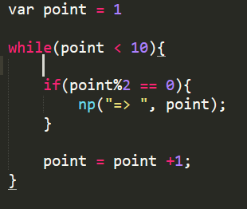

# null

Trying to create a  basic interpreted programming language  to learn more about lexers, tokens, parsing techniques etc.

## Update 

So far null is in its bare bones, it has variable declaritions like string and int plus null also supports array (early stage). There is a space left for function declaration and calling that need to be emended a big time. Currently working on some built-in functions.

## Features

- [x] integer type
- [x] string type
- [x] array
- [x] loop
- [x] accepts user input
- [x] ascii 
- [x] if - else condition
- [x] if - else if
- [ ] simple file handling
- [ ] Function

## Sample Code

> Print first 10 even numbers

  

> Basic space (Simple Esolang) implementation using Null  

  